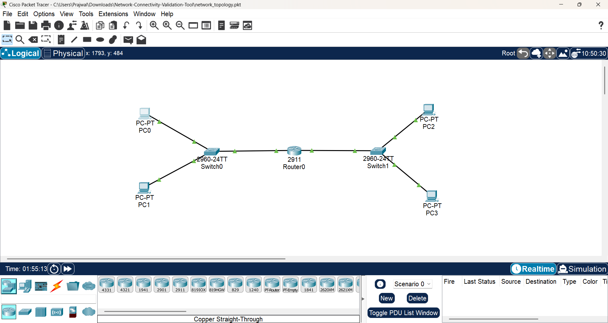
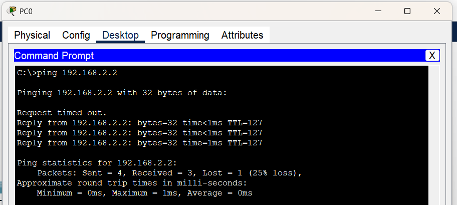
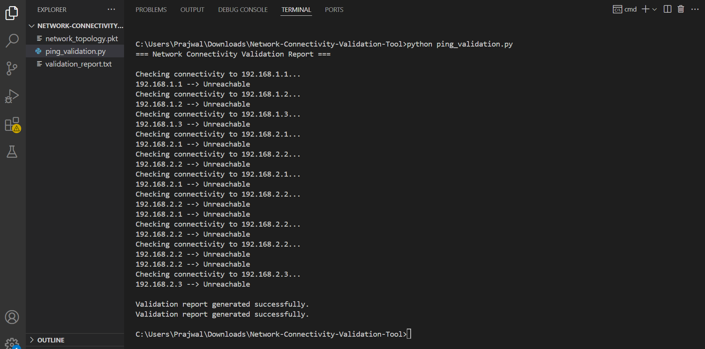

# Network Connectivity Validation Tool

## Overview
This project simulates an enterprise-style network topology using Cisco Packet Tracer and automates connectivity validation workflows using Python.

The project demonstrates:
- Routing and switching fundamentals
- IP addressing and subnetting
- Network troubleshooting
- ICMP ping validation
- Basic Python automation for network validation

---

## Technologies Used
- Cisco Packet Tracer
- Python
- TCP/IP Networking
- Routing & Switching
- ICMP Protocol
- VS Code

---

## Network Topology
The simulated topology contains:

- 1 Router
- 2 Switches
- 4 PCs
- Two different subnets

### Subnets
- 192.168.1.0/24
- 192.168.2.0/24

The router performs inter-network routing between both subnets.

---

## Features
- Router and switch configuration
- Connectivity validation between devices
- Automated ping testing using Python
- Validation report generation
- Basic network troubleshooting workflow simulation

---

## Project Files

### `network_topology.pkt`
Cisco Packet Tracer network topology file.

### `ping_validation.py`
Python automation script used for connectivity validation.

### `validation_report.txt`
Generated connectivity validation report.

---

## Python Automation Workflow
The Python script performs:
1. Automated ping checks
2. Connectivity validation
3. Reachability status reporting
4. Validation report generation

---

## Learning Outcomes
Through this project, the following concepts were practiced:

- Routing and Switching
- IP Addressing
- Subnetting
- Default Gateway Configuration
- ICMP Ping Testing
- Network Troubleshooting
- Python Automation Basics

---

## Future Improvements
- VLAN implementation
- SSH automation
- Network device monitoring
- Real device integration
- Advanced Python network automation

---

## Screenshots

### Network Topology

### Connectivity Validation

### Python Automation

---

## Author
Prajwal M
